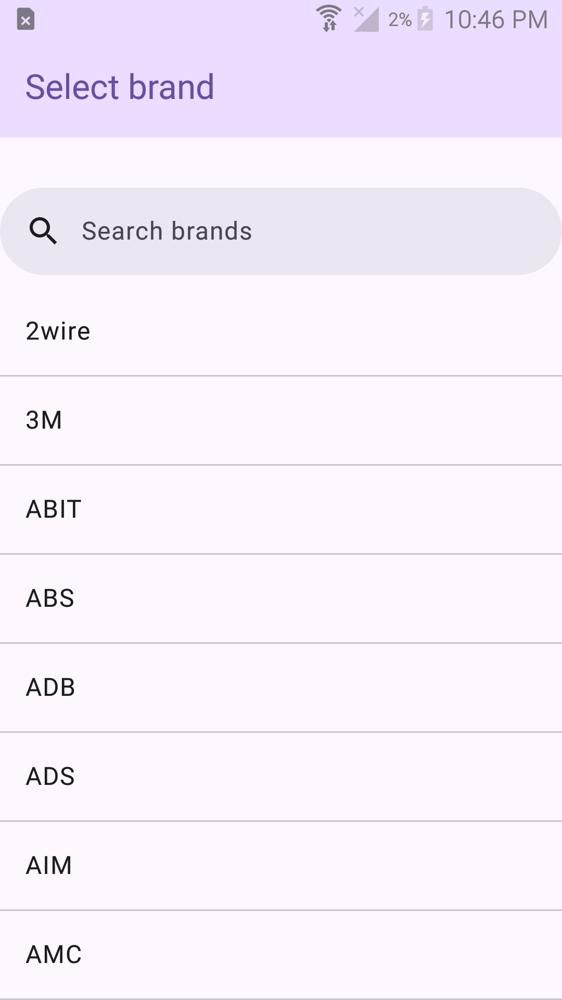
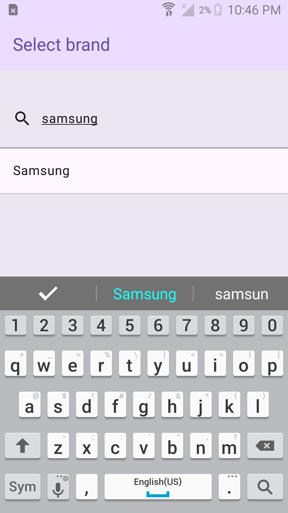
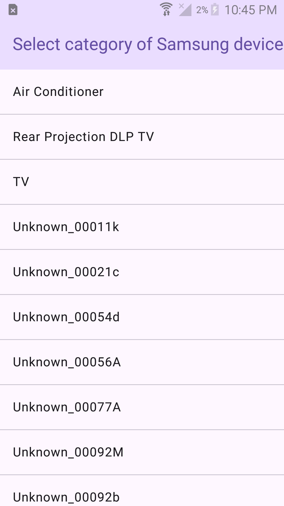
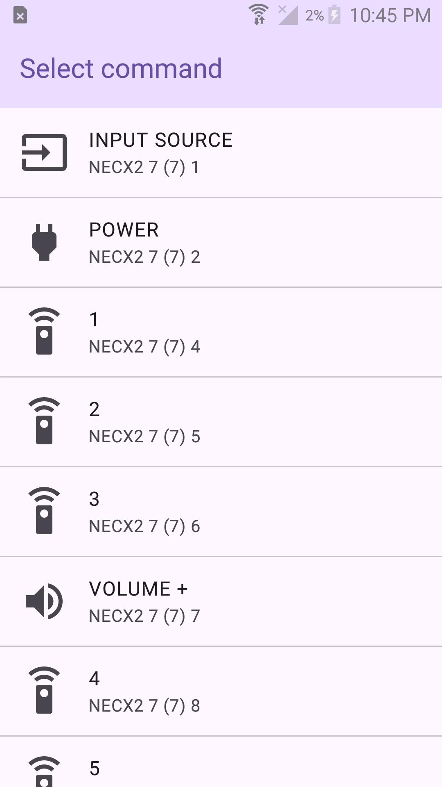
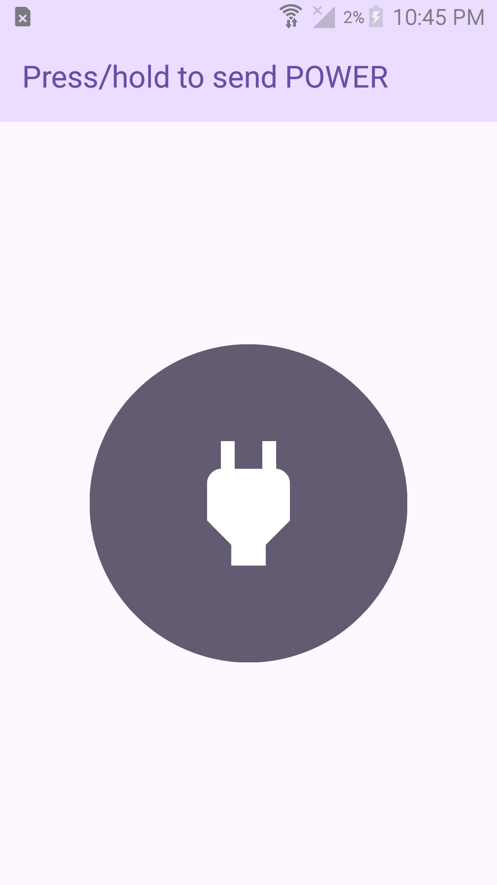

#  SupIR

SupIR is an open-source general-purpose IR blaster for Android using the [irdb](https://github.com/probonopd/irdb) database. Inspired by the now-abandoned [AndroidInfraRed](https://github.com/OneButtonDeveloper/AndroidInfraRed), SupIR puts the power of a Universal Remote or a Flipper Zero in your pocket.

    
    
    
    
    

SupIR requires an Android phone with an IR blaster. If your phone does not have an IR blaster, unfortunately, you are out of luck. Consider finding a device like a Samsung Galaxy S4/S5 and bringing it up to date with LineageOS.

## 2024-2025 Weekend Project #1

Hi, I'm Parker, and I'm a senior in High School. This year, I'm going to be making a project once every couple of weekends to keep my skills sharp and to learn new things. I'm going to be documenting my progress on this GitHub page, so I hope you stick around to see what I make!

This project was born when one of my friends in Econ asked if I could turn off the projector. I actually used to keep a Universal remote in my backpack for TVs in hotel rooms I didn't have the remote for, but I ended up taking it out of my backpack because it was too bulky. I thought it would be cool to have a device like a Flipper Zero in my backpack, but I'm broke and didn't want to buy one of those. I did, however, have a pile of old Android phones, some of which had IR blasters. 16 hours of work later, I had SupIR.

## Licenses

SupIR is licensed under the GPLv3. Non-libre licenses of its dependencies are listed below.

### AndroidInfraRed

https://github.com/OneButtonDeveloper/AndroidInfraRed

### irdb

https://github.com/probonopd/irdb

irdb
Copyright (c) 2013-15 Simon Peter and contributors

You may include this database and derivative works with your software (e.g., app) and/or
access this database over network from your commercial or non-commercial
software (e.g., app) or embedded hardware (subsequently called "your product")
provided that:

1. Prior to using this database in your product, you will inform the irdb
   project about your product by opening an issue on
   https://github.com/probonopd/irdb/issues

2. The following notice shall be included in your product:
   `Contains/accesses irdb by Simon Peter and contributors, used under permission.
   For licensing details and for information on how to contribute to the database, see 
   https://github.com/probonopd/irdb`

3. You will make available up to three fully licensed copies/units of your product
   to the irdb team, represented by Simon Peter, free of charge
   (incuding shipping and handling) upon request.

If you fail to comply with the terms of the license above, your permission to
include or access this database is revoked.

THE SOFTWARE IS PROVIDED "AS IS", WITHOUT WARRANTY OF ANY KIND, EXPRESS OR
IMPLIED, INCLUDING BUT NOT LIMITED TO THE WARRANTIES OF MERCHANTABILITY,
FITNESS FOR A PARTICULAR PURPOSE AND NONINFRINGEMENT. IN NO EVENT SHALL THE
AUTHORS OR COPYRIGHT HOLDERS BE LIABLE FOR ANY CLAIM, DAMAGES OR OTHER
LIABILITY, WHETHER IN AN ACTION OF CONTRACT, TORT OR OTHERWISE, ARISING FROM,
OUT OF OR IN CONNECTION WITH THE SOFTWARE OR THE USE OR OTHER DEALINGS IN THE
SOFTWARE.

### MakeHex

You may use, copy, modify and/or distribute this program for private or
commercial use provided that:

1)  You do not hold me responsible for any damage or negative consequences
    resulting from those activities.

2)  You include this copyright notice and disclaimer in any copy of any part
    or all of this program.

I do not provide any warranty of the correctness, safety, or suitibility of
this program for any purpose.

If you do not agree to these conditions, you have no permission to use, copy,
modify or distribute this program.

### IR Icon

CC0 License

Attribution: https://www.svgrepo.com/svg/259010/diode-led
